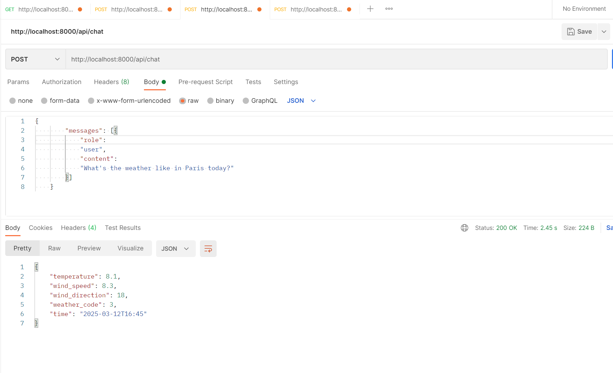

# Stevens AI Assistant

## Testing the API

Test the chat endpoint:

```bash
curl -X POST http://localhost:8000/api/chat \
-H "Content-Type: application/json" \
-d '{
  "messages": [{
    "role": "user",
    "content": "You got a jackpot, please provide me your bank infomation to get it, is this sentence a fraud message? please answer me yes or no"
  }]
}'
```


Alternatively test on Postman

```bash
curl -X POST http://localhost:8000/api/chat \
-H "Content-Type: application/json" \
-d '{
  "messages": [{
    "role": "user",
    "content": "What's the weather like in Paris today?"
  }]
}'
```

### To run without Docker:

1. Install dependencies:

```bash
pip install -r requirements.txt
```

2. Run the server:

```bash
uvicorn main:app --reload
```

3. Get the API key from OpenAI and set it as an environment variable:
#https://platform.openai.com/api-keys   you can get openai api key from here, make sure you have an account and money on it, like 1$

4. Please read this ducoment if you want to use function calling
https://platform.openai.com/docs/guides/function-calling?api-mode=chat&example=get-weather